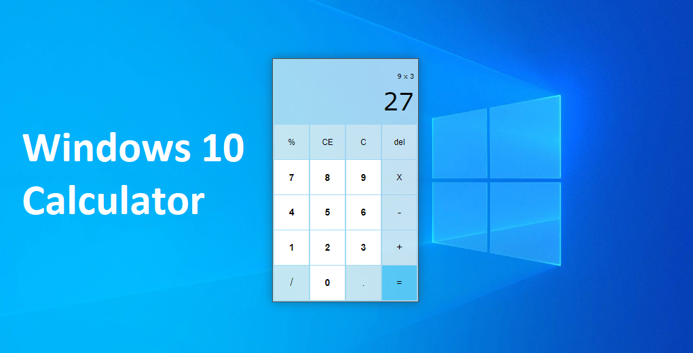
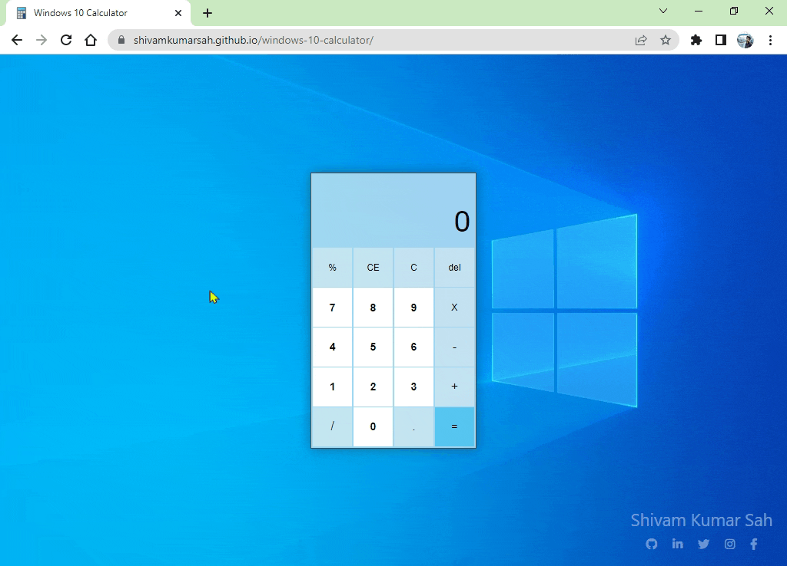

# Windows 10 style Calulator

It is a web-based calculator whose design is inspired by [Windows 10 calculator](https://github.com/microsoft/calculator). You can use both mouse and keyboard to use this calculator. The main focus of this project is to provide the same functionality, look and feel of a real Windows calculator in the browser itself.

## Demo

<h2 align="center"><a  href="https://shivamkumarsah.github.io/windows-10-calculator/">Live Demo</a></h2>

## Features

- Keyboard typing support
- Arithmatic Operations(*,/,-,+,%)

## Tech Stack

Html, Css and JavaScript

## Key Binding

| Operation             | Key                                                                |
| ----------------- | ------------------------------------------------------------------ |
| Clear Entry(CE) | Delete |
| Clear from back(del) | Backspace |
| Multiplication(X) | * |
| Subsctraction(-) | - |
| Addition(+) | + |
| Percentage(%) | % |
| Devision(/) | / |
| Result(=) | Enter |

## Future Improvements

- Add calculation history feature.
- Add more complex mathmatical operations.
- Add different calculation(i.e. Date calculation, Sceintific calculation).
- Draggable calculator

## Contributing

Contributions are always welcome!

## Feedback

If you have any feedback, please reach out to me at sahfamily91@gmail.com

## Support

Hey dude! Help me out for a cup of ☕!
  

